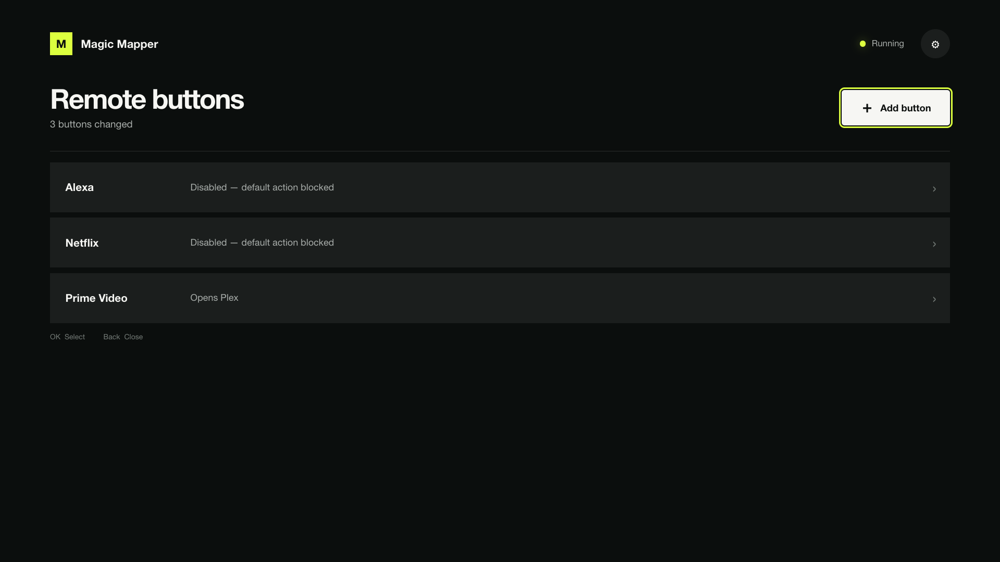

# Magic Mapper for webOS

A TV-native interface for changing what the buttons on an LG Magic Remote do. Discover, disable, or
redirect a button without editing JSON over SSH.



This is an independent Homebrew wrapper around
[Magic Mapper](https://github.com/andrewfraley/magic_mapper), not an official Magic Mapper project.
The upstream mapper stays unmodified and pinned.

## What it can do

- Discover a remote button while suppressing its normal action.
- Disable branded shortcuts such as Netflix, Prime Video, Disney+, Rakuten TV, or Alexa.
- Open any app installed on the TV.
- Make one remote button behave like another.
- Adjust OLED light, energy saving, eye comfort, Dynamic Tone Mapping, and screen power.
- Send IR, HDMI-CEC, TCP, and webhook commands, or toggle PicCap.
- Disable the Magic Remote pointer globally through a guarded, reversible setting.
- Restore individual buttons or remove Magic Mapper cleanly from the TV.

Every action exposed by the pinned upstream runtime is available through remote-friendly screens
with strict input validation and one-level-at-a-time Back navigation.


## Requirements

- A rooted LG webOS TV.
- Homebrew Channel running as root.
- Python 3 on the TV.

The current hardware target is an LG C3 running webOS 25 (internal webOS 10.3.1). Wider hardware
compatibility has not yet been claimed.

## Rooting the TV

Magic Mapper cannot run through LG Developer Mode alone: intercepting remote input and starting the
mapper at boot require root access.

Rooting support depends on the exact TV model and firmware, not only the marketed webOS version.
Before trying an exploit:

1. Check your model and firmware with [CanI.RootMy.TV](https://cani.rootmy.tv/).
2. Read the maintained [webOS Homebrew rooting guide](https://www.webosbrew.org/rooting/), including
   its risks and method-specific compatibility notes.
3. Follow the method recommended for that exact combination, then enable SSH from Homebrew Channel.

Useful methods and references:

- [SlopBro](https://github.com/throwaway96/slopbro) is a newer proof-of-concept for the `jsserver`
  vulnerability. Its author reports successful use on webOS 6 and webOS 7–10 (22–25), but describes
  it as lightly tested. From a computer on the same network, its basic flow is:

  ```sh
  git clone https://github.com/throwaway96/slopbro.git
  cd slopbro
  python3 slopbro.py <TV_IP>
  ```

  Accept the pairing prompt on the TV and follow the status shown on screen. Use the repository's
  current instructions and troubleshooting notes rather than copying commands from third-party
  guides.

- [faultmanager](https://github.com/throwaway96/faultmanager-autoroot) and
  [DejaVuln](https://www.webosbrew.org/guides/rooting/dejavuln/) cover other firmware generations.
  The compatibility checker should decide which one you use.
- [RootMy.TV](https://github.com/RootMyTV/RootMyTV.github.io) documents the older browser-based
  method and its technical background. It was patched on newer firmware and is mainly relevant to
  older TVs.
- The [webOS Homebrew SDK guide](https://www.webosbrew.org/pages/sdk-configuration.html) explains
  how to configure SSH and the webOS CLI after rooting.

Software exploits generally fail without harming the TV, but careless changes made with root can
brick it. Do not expose SSH or Telnet to the internet, re-check compatibility before installing
firmware updates, and do not install LG's Developer Mode app on an already rooted TV.

## Installing from Homebrew Channel

Magic Mapper publishes a `repo.json` repository index with every release, so Homebrew Channel can
track it and offer updates. The TV still needs root access and Homebrew Channel running as root.

In Homebrew Channel, open **Add repository** and enter:

```
https://github.com/afonsojramos/magic-mapper-webos/releases/latest/download/repo.json
```

Magic Mapper then appears in the app list and updates alongside everything else Homebrew Channel
manages.

## Manual installation

Magic Mapper can be installed without the webOS Homebrew repository. This only replaces the app's
distribution path: the TV still needs root access and Homebrew Channel running as root.

Download the latest `com.github.afonsojramos.magicmapper_*_all.ipk` from the
[GitHub releases page](https://github.com/afonsojramos/magic-mapper-webos/releases/latest).

### webOS Dev Manager (documented, not yet tested)

webOS Dev Manager officially supports rooted TVs and installing local IPKs, but this project has not
yet tested the following path with Magic Mapper:

1. Enable SSH in Homebrew Channel and add the rooted TV to
   [webOS Dev Manager](https://github.com/webosbrew/dev-manager-desktop).
2. Choose **Install app**, select the downloaded IPK, and wait for installation to finish.
3. Launch Magic Mapper from the TV's app list.

Dev Manager works on Windows, macOS, and Linux and does not require the LG SDK.

### Command line (tested)

This is the installation method used for the current LG C3 hardware testing.

Configure the TV as a rooted device by following the
[webOS Homebrew SDK guide](https://www.webosbrew.org/pages/sdk-configuration.html). Once
`ares-install` can reach the device, download the latest IPK with the GitHub CLI:

```sh
gh release download --repo afonsojramos/magic-mapper-webos --pattern '*.ipk'
```

Then install it:

```sh
ares-install --device webos com.github.afonsojramos.magicmapper_*_all.ipk
```

Installing an update uses the same command and preserves mappings stored under
`/var/lib/webosbrew/magic-mapper`.

## How it works

The TypeScript interface is built with Vite, SolidJS 2, and Tailwind CSS 4. Vite emits relative
asset URLs so the compiled application runs directly from its webOS package.

The managed runtime in [`runtime/managed_mapper.py`](runtime/managed_mapper.py) owns the input loop
and loads the upstream actions and button definitions. It adds one-shot discovery, authoritative
status, graceful input release, and app lifecycle handling.

The upstream source pin and checksum live in [`vendor/upstream.json`](vendor/upstream.json).
Packaging verifies that [`vendor/magic_mapper.py`](vendor/magic_mapper.py) still matches that
checksum.

## Development

[Nub](https://nubjs.com/) 0.7.5 and Node.js 24 or newer are required.

```sh
nub ci
nub run check
nub run package
```

The IPK is written to `dist/`. `nub run manifest` creates the Homebrew Channel release manifest and
the `repo.json` repository index beside it.

Useful commands:

```sh
nub run dev           # Vite development server
nub run format        # Format supported files with oxfmt
nub run lint          # Lint TypeScript and JavaScript with oxlint
nub run sync-upstream # Re-fetch the pinned upstream source
```

Updating the upstream pin is a deliberate review step: update the commit and checksum, sync it,
inspect the diff, and repeat the full hardware checks.

### Browser flow

Install the optional Python dependency, build the app, and keep the preview server running:

```sh
python3 -m pip install -r requirements-dev.txt
nub run build
nub run preview
```

Run the Playwright flow from another terminal:

```sh
nub run test:e2e
```

The flow also refreshes the two screenshots in `assets/screenshots/`.

## Releasing

Releases are created by hand: push to `main`, then draft a new GitHub release with the version
number as the tag (e.g. `1.0.9`, no `v` prefix required).

Publishing the release drives the build. CI writes the tag's version into `appinfo.json` and
`package.json`, builds the IPK, and attaches it to the release along with `repo.json` describing
that exact build. Versions are never bumped by hand, and nothing is committed back to `main`, so
`appinfo.json` in the repository is a placeholder that the release build overwrites.

## State and removal

Mappings and runtime state live under `/var/lib/webosbrew/magic-mapper`. The startup hook lives at
`/var/lib/webosbrew/init.d/50-magic-mapper`.

Uninstalling from the app stops the process, releases the exclusive input grab, removes the startup
hook and state, and asks webOS to remove the application.

## License

Released under the MIT License. The vendored upstream file retains Andy Fraley's copyright and
license; wrapper code is copyright Afonso Ramos.
